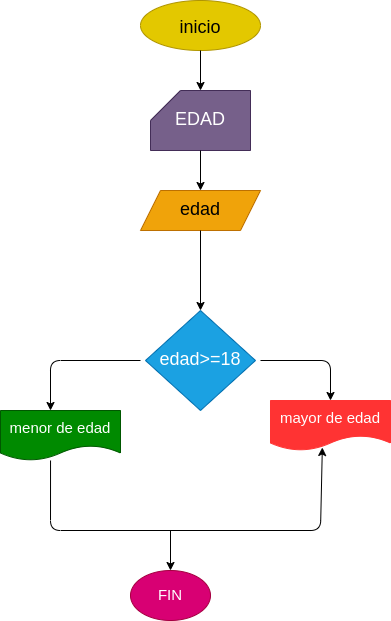

# EJERCICIO 1 ESTRUCTURAS CONDICIONALES

## Programa para verificar si usted es mayor de edad

## ANALISIS

### Definicion de variables

edad: edad de la perosna
Si la persona tiene 18 o mas años es considerada mayor de edad

## DISEÑO

